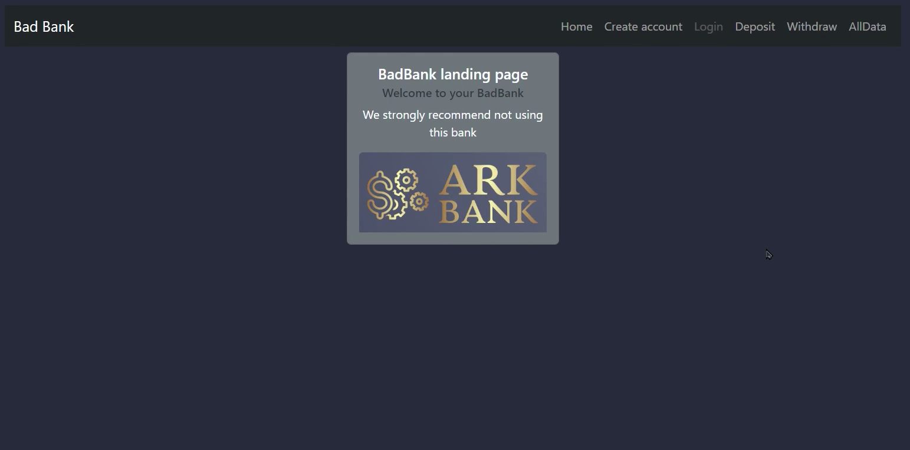
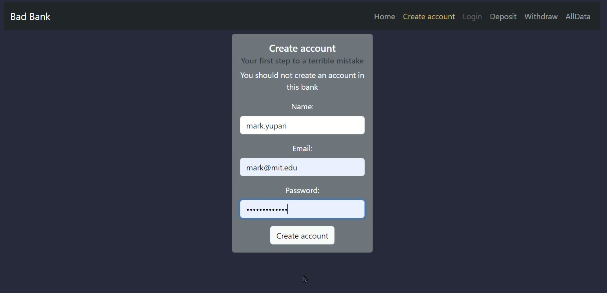
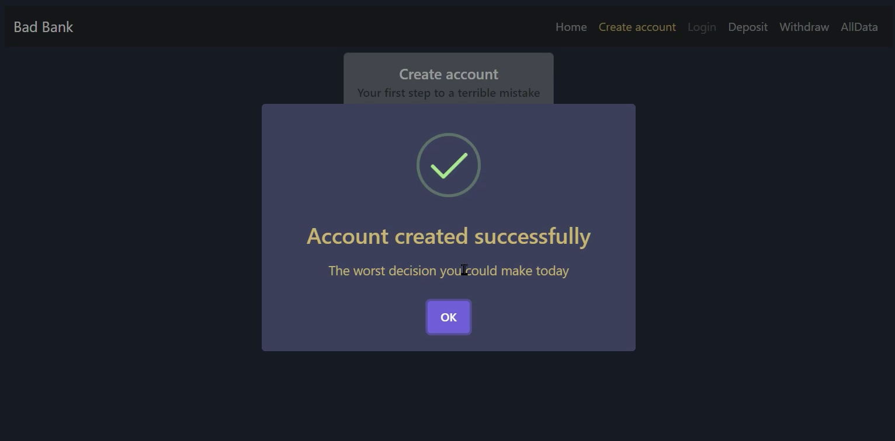
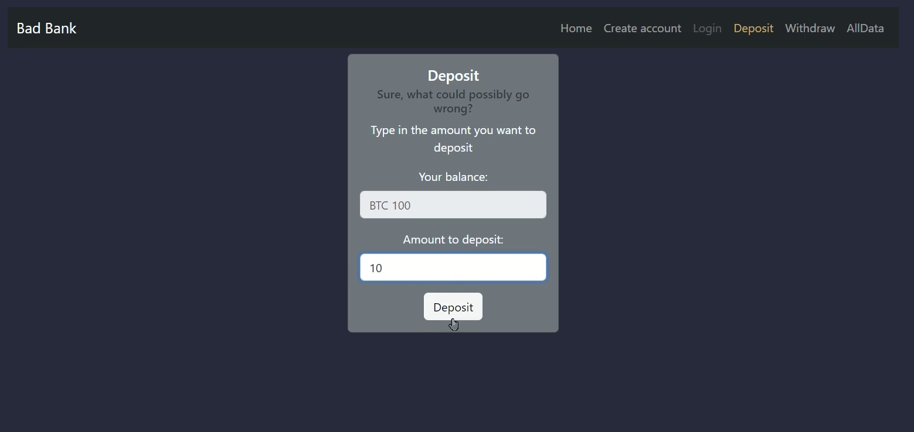
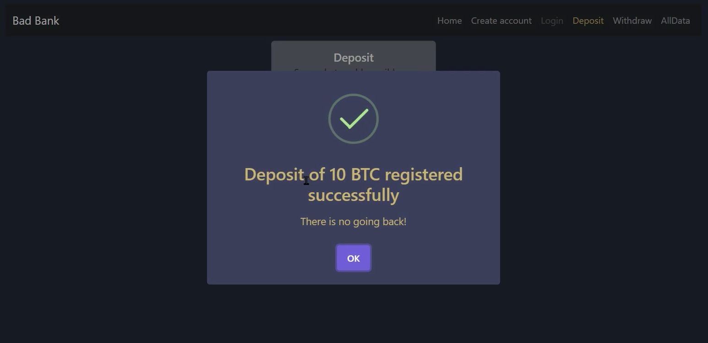
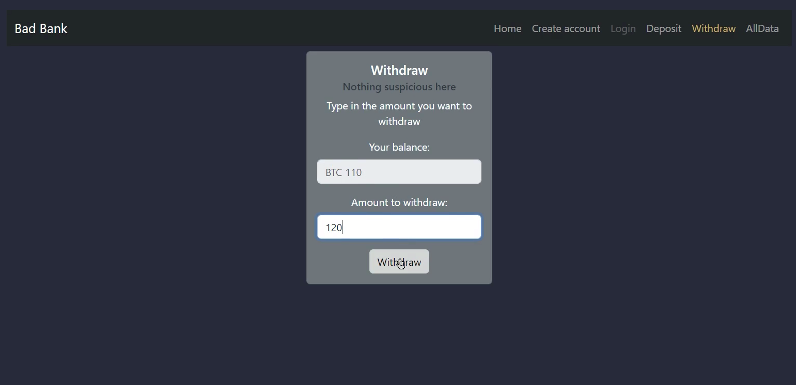
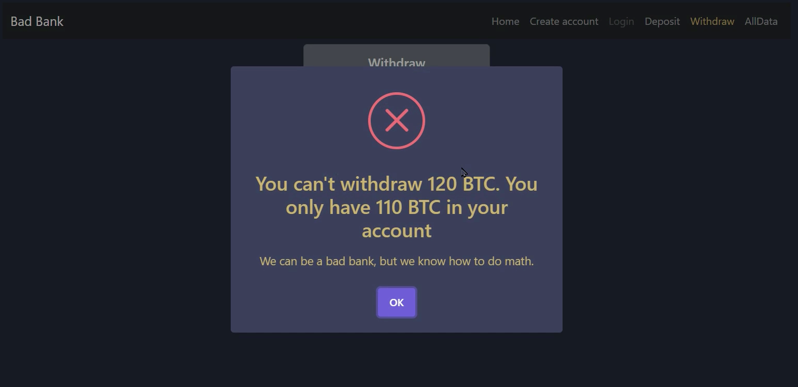

<h1> Ark Industries</h1>

> Version 1

Ark Industries will be a reference for automation in the history of technology.

<h1>Bad Bank Application</h1>

## Description

This repository of a Bad Bank application can be used for beginners in the web development World to create their first fullstack.  
If you are learning React with Routes you can use this repository as an example.  

## How to run

To use it locally, fork it to your repository and then download it to your computer. Use command npm install to download all the modules requiered by the app and command npm run dev to start a local server (http://localhost:5173/) to display the page.  
You can see it work here: <a href="https://markyupari.github.io/bad-bank-1.0/" target="_blank">https://markyupari.github.io/bad-bank-1.0/</a>
For more information on how to deploy a Vite React project like this visit <a href="https://vitejs.dev/guide/#scaffolding-your-first-vite-project" target="_blank">vitejs.dev</a>

## Features

This page is an example of how to make a Banking website with some basic functionalities:

<ul>
  <li><strong>Home:</strong> Landing page where a welcome message and an image of the bank logo are shown.</li>
  <li><strong>Create account:</strong> A form with a name, email, and password input fields and a submit button. Validation is checked for each field, and a message is shown when a field is not valid. Also, the submit button is disabled if there is no data in the input fields. When a user is created, a success message is shown. After creating a user, a button for creating another user appears. This button clears the form.</li>
  <li><strong>Deposit:</strong> A form showing the current user balance, an input field to type in the amount to deposit, and a button to register the deposit. Negative numbers and letters are not allowed and a message is shown when the deposit button is pressed. When a successful deposit is registered, the balance is updated and a success message is shown. If there is nothing in the input field, the deposit button is disabled.</li>
  <li><strong>Withdraw:</strong> A form showing the current user balance, an input field to type in the amount to withdraw, and a button to register the withdrawal. Negative numbers and letters are not allowed and a message is shown when the withdraw button is pressed. When a successful withdrawal is registered, the balance is updated and a success message is shown. If there is nothing in the input field, the withdraw button is disabled. When there is an attempt to withdraw an amount greater than the balance, an error message is shown.</li>
  <li><strong>All data:</strong> The information of all the user's name, email, password, and balance is shown in a table with headers</li>
</ul>
React hooks like useState and useContext are used to track variables.  
React-bootstrap is used to style the components.  

## Screenshots

<ul>
  <li></li>
  <li></li>
  <li></li>
  <li></li>
  <li></li>
  <li></li>
  <li></li>
</ul>

## Technology

<strong>Front-End:</strong> React with Vite.  
<strong>Back-End:</strong> Express for the server and MondoDB in Docker for the database.  

## Support

You can mail me any question to yupari87157@gmail.com  
You can add me on LinkedIn for some explanation about the use of this code.

Add me: <a href="https://www.linkedin.com/in/markyupariruiz/" target="_blank">Mark Yupari LinkedIn profile</a>

## Roadmap

In next version, a login option will be added.

## License

This file is free and open source. You can use it for commercial projects, open source projects, or really almost whatever you want.
